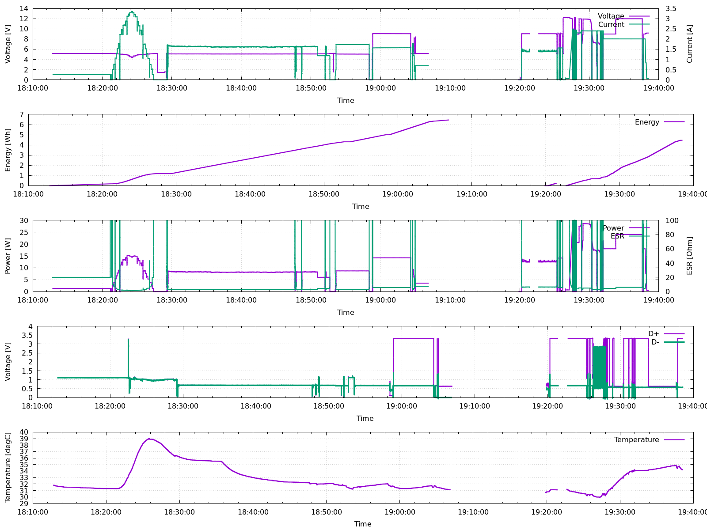
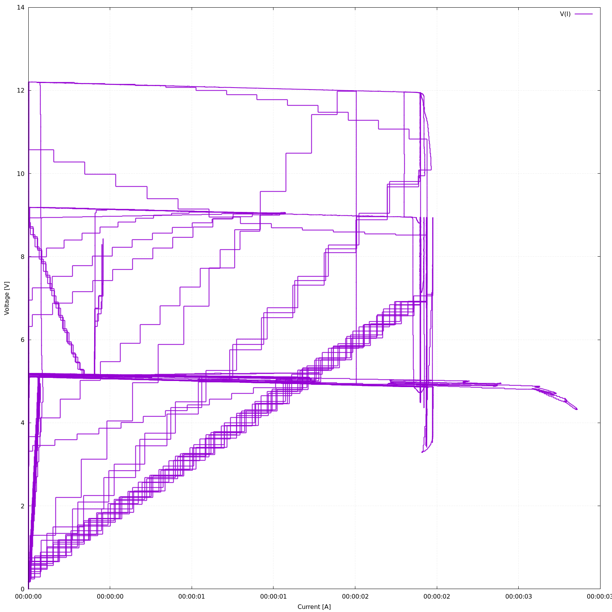

Data logger for FNIRSI FNB48, FNIRSI C1 and FNIRSI FNB58 USB power meters
------------------------------------------------------------

FNIRSI FNB48, FNIRSI C1 FNIRSI FNB58 are cheap and relatively good USB
power meters, supporting various charging protocols, voltages, and
additionally PC communication.

This is a result of reverse engineering of FNB-48 protocol over lazy
Saturday.


Requirements
------------

Linux. (It might work on non-linux systems too, but untested)

Python 3.6 or newer (tested in Python 3.9 only).

Make sure to have `pyusb` Python package installed. It ia also
recommended to install `crc` package.

In Debian/Ubuntu: `sudo apt-get install python3-usb`.

Alternatively `python3 -m pip install pyusb crc` should also work and
get you latest version.


Running
-------

Just run `sudo ./fnirsi_logger.py`

Data will be printed in real time to standard output. Feel free to save
to file using standard shell file redirection or pipe to some other
program. Program will exit if the connection is lost.

Format is space separated text file.

```

timestamp sample_in_packet voltage_V current_A dp_V dn_V temp_C_ema energy_Ws capacity_As
1657568326.775 0 0.00000 0.00011 1.184 1.031 30.500 0.000000 0.000001
1657568326.785 1 0.00000 0.00000 1.184 1.033 30.500 0.000000 0.000001
1657568326.795 2 0.00000 0.00011 1.184 1.030 30.500 0.000000 0.000002
1657568326.805 3 0.00000 0.00000 1.184 1.031 30.500 0.000000 0.000002
1657568326.784 0 0.00000 0.00011 1.185 1.032 30.500 0.000000 0.000003
1657568326.794 1 0.00000 0.00000 1.184 1.029 30.500 0.000000 0.000003
1657568326.804 2 0.00000 0.00000 1.184 1.029 30.500 0.000000 0.000003
1657568326.814 3 0.00000 0.00000 1.188 1.042 30.500 0.000000 0.000003
1657568326.824 0 0.00000 0.00000 1.197 1.060 30.500 0.000000 0.000003
```


Note: For convenience of using in gnuplot and using shell file append of
multiple runs, programs add an empty line before emiting data. This way
in gnuplot missing data semantic is automatically detected, resulting in
better plots.

For long data logging sessions, it is recommended to use compression, for
example:

`./fnirsi_logger.py | gzip > mydata.txt.gz`

You can also use pipeing to ingest it into other systems, like
monitoring, databases, alerting / notifications, or implement extra
feature (multi-point calibration, cross device triggers, etc).


Note: Program requires root privileges at the moment, as the FNIRSI
devices present itself as HID USB device, and not a serial port, so it is
not easy to setup permissions for normal user. If you know some solution
using udev let me know. Hint: If you know bus and device if of the power
meter you could try changing device file permissions, like this: `sudo
chown $USER /dev/bus/usb/001/030` and then run `./fnirsi_logger.py` from
normal user account. The issue is while bus value should be constant,
device id might change, even if the power meter is plugged into same USB
port, due to dynamic USB device id assignment at initialization and
enumeration.

Running under normal user (non-root)
--------------------

Install udev rules:

```shell
$ sudo install --mode=0644 --target-directory=/etc/udev/rules.d/ udev/90-usb-power-meter.rules
$ sudo udevadm trigger
```

This should make `fnirsi_logger.py` work from any user account.

Accuracy / resolution
---------------------

Time - few ms. By default samples every 10ms (technically 4 samples every
40ms). Time is printed as UNIX epoch in seconds, with 1ms resolution.

Voltage, current - all printed decimal digits. 0.00001 unit.

Temperature - device resolution is 0.1°C, but a low pass filter is used
to smooth it a bit, and output with 0.01°C. Less than a second delay
expected. As far as I can tell negative values for temperature are not
supported, it will report close to 0°C. Temperatures in range 0–70°C were
tested.

Energy and capacity - all printed decimal digits. Note: Device does not
send energy and capacity. Values are integrated (from power and current)
on the host instead. They do start at zero at program startup.

Note: It is expected voltage are positive, if not Energy and Capacity
might go backwards!

Note: Power is not provided in the output. Just multiply voltage and
current values to get power in Watts.


Supported devices
-----------------

FNIRSI FNB48 and FNIRSI C-1 are known to work. It will use first that it
finds.

FNIRSI FNB58 is also known to work, thanks to work of @didim99.

Make sure to have relatively recent firmware. My FNIRSI C-1 came with
very old firmware (0.20) that did not work out of the box, but upgrading
to the latest firmware (0.70) made everything work with exactly same
code.

Multiple devices in parallel
----------------------------

It is very easy to add, but I didn't have a use for it. Just open
an Issue in GitHub and I will add it.


Data analysis
-------------

You can do whatever you want, it just simple text data that can be feed
to file or a pipe. Import to program, spreadsheet, Python, R, Octave,
gnuplot, export to InfluxDB, Prometheus, Kafka, MQTT. For quick and dirty
work, one can use `awk`, `sort`, or my command-line program
[kolumny](https://github.com/baryluk/kolumny). There are no limits.

Also program is simple enough that you can modify it to directly process
data in Python.

As an example of data analysis and for convinience, in this repo you fill
find a bundled gnuplot sciript `plot.gnuplot` . If you have gnuplot
installed (On Debian/Ubuntu: `sudo apt install gnuplot-11`), just run it
with `./plot.gnuplot datafile.txt` and will output `plot.png` and
`plot-iv.png` with essential timeseries.

You can call it in 3 forms:

```shell
./plot.gnuplot                       # will read live.txt file, and produce png files
./plot.gnuplot otherfile.txt         # will read otherfile.txt, and produce png files
./plot.gnuplot otherfile.txt --live  # will read otherfile.txt, and redraw plot window every 10 s
```

To do live plotting, in on terminal do for example:

```shell
$ ./fnirsi_logger.py >> /tmp/fnirsi-live.txt
```

and in another do:

```shell
$ ./plog.gnuplot /tmp/fnirsi-live.txt --live
```

(If you want to overwrite data).


Examples:





Hint: The first parameter can be a file or any gnuplot filespec, for
example a pipe for decompression: `./plot.gnuplot "<zcat mylog.txt.gz"`


Limitation
----------

All values seems to be correct. No extra calibration curves are2 used, as
device sends values that already have device calibration applied.

Program uses fixed sampling rate of 100 samples per second. (highest). If
you want lower sampling rate, just skip some output lines. In gnuplot to
speed up very long (days) logs, use `every 10` for example, to skip lines
automatically. If you really need lower sample rate, open a GitHub Issue
about it.

There are two values in the protocol, that do have unknown function.
Decrypting what they mean seems elusive (one is constant, other one is
totally random).


TODO
----

Requires root privileges.

Sometimes on program exit, the power meter display gets frozen.

It might make sense to add triggers (configured via command line
options): when to start outputing data (i.e. when current goes from low
to above 20mA), and when to stop outputing data and exit (i.e. when
current goes back to below 10mA for 60 consequtive seconds). It is easy
to add, I just do not have much use for it personally.

Power Delivery type detection does not work.

Firmware update still requires Windows. Running in qemu / virt-manager,
and doing USB redirect works for this purposes. Unlikely to be
implemented.

FAQ
---

Will you add ability to write to X, Y or integrate with Z? No. Just write
adapter that read the decoded data via a pipe and writes what you need to
the system of your choice. It is way more modular, easier to implement,
and makes long term maintance trivial. The current `fnirsi_logger.py` has
no dependencies and no configuration. It just works. Adding more would
make it harder to use and maintain. (I do have adapter that writes output
to InfluxDB, but it is not a part of this project - by design).
